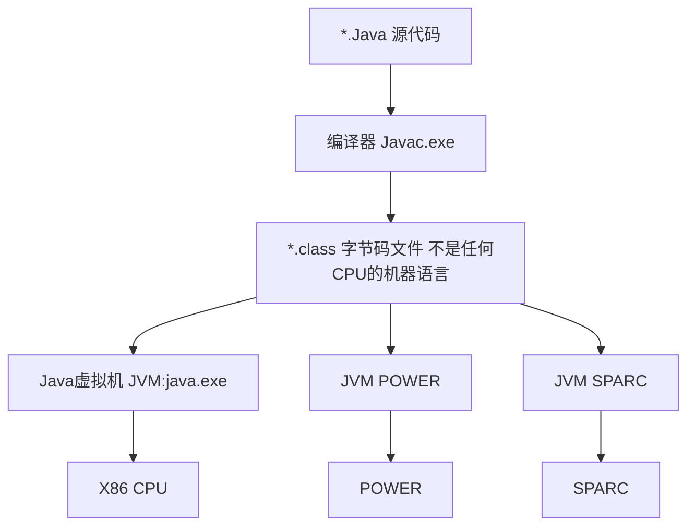

# Java 编译结构



## 认识JVM、JRE、JDK

### 1.JVM：Java Virtual Machine

+ Java虚拟机，只识别*.class的文件。

+ Java跨平台的核心。

+ Java语言一次编译，到处运行，适合异构系统环境，是一门跨平台的语言。

### 2.JRE：Java Runtime Environment

+ Java运行环境，包含：JVM和相关库。

+ JRE = Windows

### 3.JDK：Java Development Kit

+ Java开发工具包，包含编译器、源代码、API文档及完整的JRE。

+ JDK是整个Java开发的核心。

+ JDK = Visual Studio + Windows
  + SE (J2SE) 标准版，常用此版本。主要用于桌面应用开发，是Java的基础。
  + EE (J2EE) 企业版，用于开发J2EE应用。
  + ME (J2ME) 用于开发移动、嵌入式设备的应用。

# 配置Java开发环境

## 1. 下载JDK

[下载地址](https://www.oracle.com/technetwork/java/javase/downloads/jdk13-downloads-5672538.html)


按照自己的系统选择相应的版本。

这里以Win10 64为例子，待JavaSE安装完成后，一键安装。

我的电脑-右键-属性-高级系统设置-环境变量-系统变量-新建

新建变量名：JAVA_HOME，变量值：JDK安装目录


新建变量名：CLASSPATH，变量值：.;%JAVA_HOME%\lib;%JAVA_HOME%\lib\tools.jar


新建两条路径：%JAVA_HOME%\bin %JAVA_HOME%\jre\bin


保存完毕后打开CMD，分别输入java -version；javac -version能正常运行则表示配置成功。

## 2. 安装Eclipse

这里用Eclipse作为开发Java的IDE，IntelliJ IDEA也是不错的开发工具（收费）。

[下载地址](https://www.eclipse.org/downloads/packages/)

# HelloWorld

打开安装好的 Eclipse.exe 点击 File -> New -> Project

选择 Java Project


Project name：输入自定义的项目名称

在新建好的项目中继续新建一个类（Class）

Package 表示一个包名 也就是一个文件夹的名称


这里类名为 Tester

```java
public class Tester {
	public static void main(String[] args) {
		System.out.println("Hello,World");
	}
}
```

右键 Run As 或者 Ctrl + 11

即可输出

## Main函数

在Java中，main()方法是Java应用程序的入口方法，也就是说，程序在运行的时候，第一个执行的方法就是main()方法，这个方法和其他的方法有很大的不同，比如方法的名字必须是main，方法必须是public static void 类型的，方法必须接收一个字符串数组的参数等等。