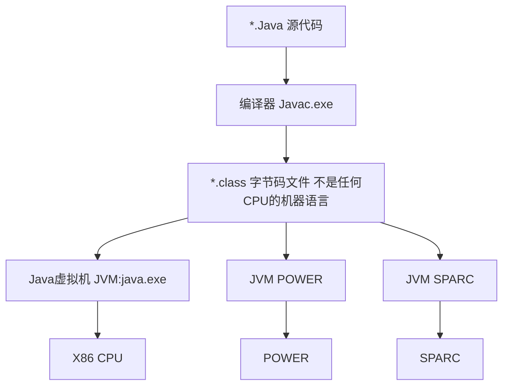

Java学习之路

[TOC]

# 序

## Java 编译结构

## 认识JVM、JRE、JDK

### JVM：Java Virtual Machine

1. Java虚拟机，只识别*.class的文件。
2. Java跨平台的核心。
3. Java语言一次编译，到处运行，适合异构系统环境，是一门跨平台的语言。

### JRE：Java Runtime Environment

1. Java运行环境，包含：JVM和相关库。
2. JRE = Windows

### JDK：Java Development Kit

1. Java开发工具包，包含编译器、源代码、API文档及完整的JRE。
2. JDK是整个Java开发的核心。
3. JDK = Visual Studio + Windows
   * SE (J2SE) 标准版，常用此版本。主要用于桌面应用开发，是Java的基础。
   * EE (J2EE) 企业版，用于开发J2EE应用。
   * ME (J2ME) 用于开发移动、嵌入式设备的应用。

# 一、配置Java开发环境

## 下载JDK

[下载地址](https://www.oracle.com/technetwork/java/javase/downloads/jdk13-downloads-5672538.html)

按照自己的系统选择相应的版本。

这里以Win10 64为例子，待JavaSE安装完成后，一键安装。

我的电脑-右键-属性-高级系统设置-环境变量-系统变量-新建

新建变量名：JAVA_HOME，变量值：JDK安装目录

新建变量名：CLASSPATH，变量值：.;%JAVA_HOME%\lib;%JAVA_HOME%\lib\tools.jar

保存完毕后打开CMD，分别输入java -version；javac -version能正常运行则表示配置成功。

## 安装Eclipse

这里用Eclipse作为开发Java的IDE，IntelliJ IDEA也是不错的开发工具（收费）。

[下载地址](https://www.eclipse.org/downloads/packages/)

